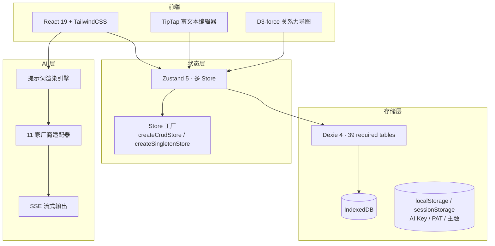
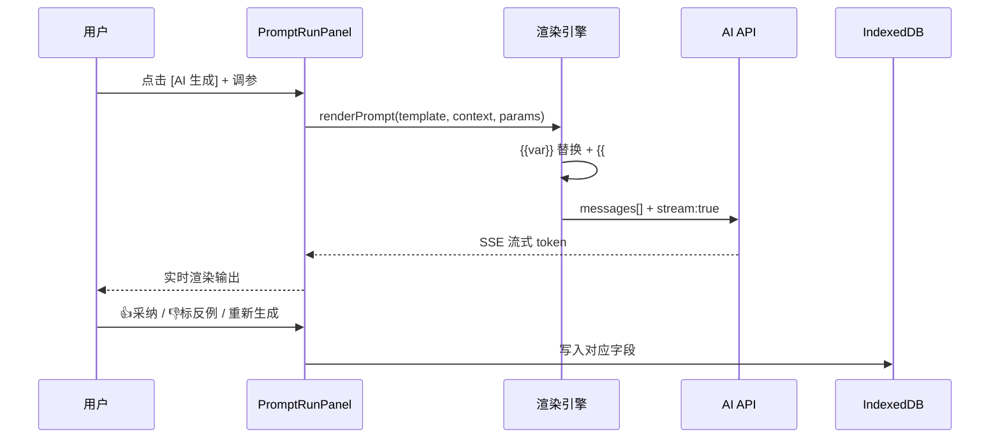
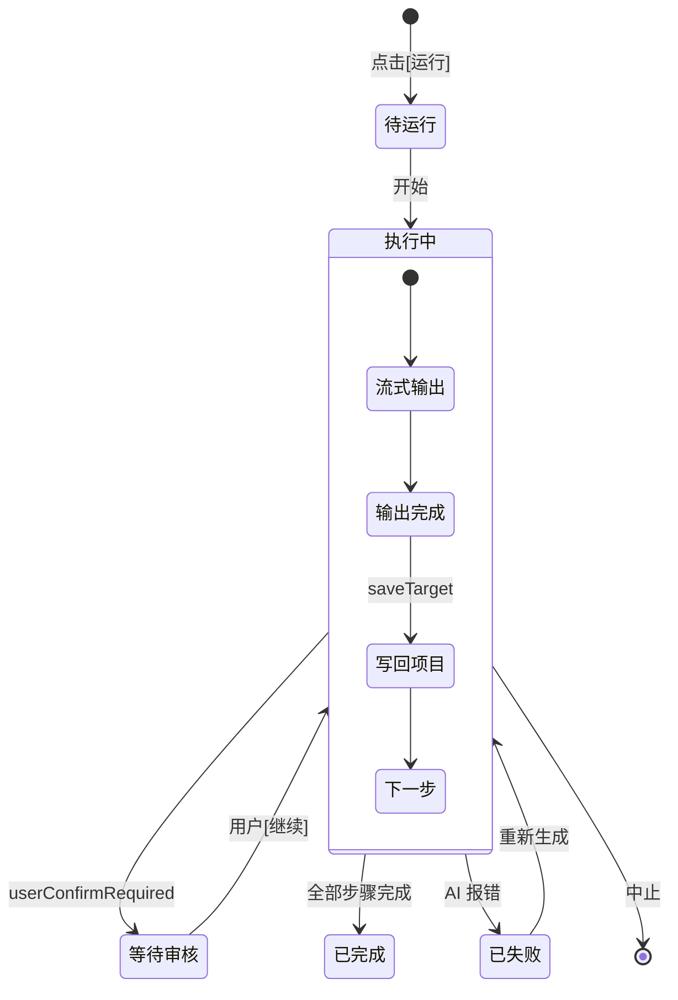
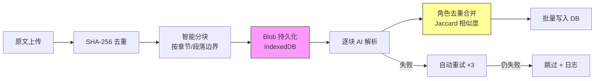

# 🔥 StoryForge · 故事熔炉

> **项目截图、开发进度、使用教程在知乎同步更新，欢迎来知乎交流：**  
> **📄 [知乎专栏文档](https://zhuanlan.zhihu.com/p/2038714210188780594)**  
> **💬 QQ 交流群：1082374587**（欢迎加群讨论需求、反馈 bug、交流小说创作）
> **项目视频说明书** https://www.bilibili.com/video/BV1q37j6QExh/?vd_source=f5f8f127d3b9d13bc53e7394ffe8902b#reply116816768865987

---


> **AI 辅助小说创作工作台** — 纯前端、本地优先、11 家 AI 厂商任选。  
> 提示词全可见、可调、可保存 — 不做黑箱，让作者掌控每一段 AI 输出。

```
GitHub: https://github.com/yuanbw2025/storyforge
```

---

## 🌐 English (TL;DR)

**StoryForge** is a privacy-first, local-first browser-based AI writing studio for long-form fiction.

- **Local-first by default** — your manuscript lives in your browser's IndexedDB. If you enable AI, cloud backup, or a custom proxy/base URL, relevant content is sent to the third-party service you configured.
- **Bring your own AI** — works with 11 OpenAI-compatible providers; you supply the key.
- **No black box** — every prompt is visible, editable, and savable. You control every AI output.
- **Built for series-scale work** — multiworld settings, a three-layer memory system, a codex/worldbuilding registry, consistency checking, and reverse-inference from fragments.

**Architecture** is built on three single-source-of-truth registries (read / write / lifecycle), enforced by CI to keep the codebase clean as it grows. See [`CLAUDE.md`](./CLAUDE.md) and [`docs/MASTER-BLUEPRINT.md`](./docs/MASTER-BLUEPRINT.md).

Quick start:

```bash
npm install
npm run dev      # http://localhost:1111/storyforge/
npm run ci       # required-table check + AI manual check + architecture check + typecheck + coverage + build
```

Contributions welcome — read [`CONTRIBUTING.md`](./CONTRIBUTING.md) first.

---

## 目录

- [价值主张](#-价值主张)
- [系统架构](#-系统架构)
- [功能全景](#-功能全景)
- [历史题材增强](#-历史题材增强)
- [提示词系统 ⭐](#-提示词系统--核心差异化)
- [工作流引擎](#-工作流引擎)
- [导入系统](#-导入系统)
- [大师研读](#-大师研读系统)
- [导出系统](#-导出系统)
- [AI 集成](#-ai-集成)
- [技术细节](#-技术细节)
- [快速上手](#-快速上手)
- [演化历程](#-演化历程)

---

## ✨ 价值主张

市面多数 AI 写作工具把提示词锁在后端黑箱。StoryForge 反其道而行 — **把整个提示词系统开放给作者**：

| 维度 | 做法 |
|---|---|
| **看得见** | 每个 AI 按钮背后的 system prompt + user template 完整可见 |
| **改得动** | 参数滑块 / 文字覆盖 / 临时修改，三层调整粒度 |
| **存得住** | 一键「克隆为我的版本」，下次直接用 |
| **跑得连** | 链式工作流一键跑完"故事核心 → 世界观 → 角色 → 大纲 → 第一章" |
| **学得到** | 大师研读 + 历史资料分析双轨运行，提炼方法论与时代细节反哺创作 |

---

## 🏗 系统架构



### 数据流：AI 生成全链路



---

## 🗺 功能全景

侧边栏 **5 大一级模块**，三级折叠树导航：

### 📚 著作信息

| 子模块 | 内容 |
|---|---|
| **项目概况** | 名称 / 流派标签（77 条，按起点/纵横/晋江分类）/ 简介 / 目标字数（≤500万）/ 状态（构思/连载/暂停/完结）/ 统计面板（创建日期、连续创作天数、最近更新）|
| **项目参考** | 「故事参考」「风格参考」「历史资料」三类参考源；历史资料支持上传文献/论文做 13 维分析，结果本地保存并可在创作时引用 |

### 🌍 设定库

#### 世界观（3 个子模块 + 历史年表；支持项目级「幻想设定 / 历史考证」模式切换）

| 子模块 | 字段 |
|---|---|
| **世界起源**（3 字段）| 幻想模式：世界来源 / 力量层次 / 神明设定；历史模式：历史时期与架空度 / 社会等级与官职 / 宗教与民间信仰 |
| **自然环境**（7 组字段）| 幻想模式：世界结构 / 大陆分布 / 气候 / 自然资源；历史模式：真实地理与地名考据 / 疆域与行政区划 / 核心城市与重镇 / 重要水系与漕运 / 气候与自然灾害 / 特产与战略物资 |
| **人文环境**（7 字段）| 幻想模式：世界历史线 / 大事记 / 种族 / 势力 / 政治经济文化 / 冲突 / 道具；历史模式：历史时期与架空度 / 重大历史事件 / 民族与外族关系 / 朝堂党争与地方势力 / 经济与赋税制度 / 社会矛盾与冲突 / 时代科技与生产力 |
| **历史年表** | 独立时间轴 + 关键词细节库：真实史实/虚构事件切换、数字化年份排序、史料来源、章节关联、AI 历史考证、AI 细节头脑风暴 |

> **智能上下文**：点 AI 生成时，已填字段自动作为 context 传入；历史模式下还会把 `creativeMode=historical` 注入 prompt，引导模型优先做史实校验、时代名词考据与时代错乱规避。

#### 故事设计（7 字段，全部 AI 生成 + 调参）

一句话故事（logline）· 故事概念 · 主题 · 核心冲突 · 故事模式（线性/莲花地图/多线并行/蒙太奇）· 主线 · 复线

#### 角色设计（4 级分档 + 关系网）

| 角色等级 | 视图形式 | 适用 |
|---|---|---|
| 主角 / 重要配角 | 大卡片完整表（全字段 + AI 设计 + 调参）| 弧光完整的核心人物 |
| 次要角色 | 小卡片 3 列网格 | 有戏份但不主导的配角 |
| NPC | 紧凑列表（姓名+地点+一句话）| 常驻不出场角色 |
| 路人 | 5 列表格（姓名/出场/章节/作用/结局）| 群像一笔带过 |

**关系网**：D3-force 力导图，支持亲属/师友/敌对/暧昧/合作/竞争六类关系可视化。

**角色动态状态**：从状态卡实时获取角色当前位置、实力、持有物品等；出场章节追踪（首次出场/活跃范围/退场），AI 写作时自动过滤未出场/已退场角色。

### 🧠 三层记忆系统

| 层 | 内容 | 作用 |
|---|---|---|
| **Working Memory** | 当前章节 + 近 3 章摘要 | 即时上下文，保证连贯性 |
| **Episodic Memory** | 状态卡 + 事件 + 关系变动 | 追踪角色/物品/势力状态变更 |
| **Semantic Memory** | 世界观 + 角色 + 故事线 + 伏笔 | 长期设定知识，按任务类型分配 token 预算 |

- **状态表自动提取**：AI 生成正文后自动提取角色/地点/物品/势力的状态变更
- **章节摘要**：AI 自动生成 100-200 字章节摘要，注入 Working Memory
- **事件时间线**：状态表"时间线"视图，事件按章节时间轴展示
- **情感节拍卡**：每章自动分析情绪走向，生成情感节拍可视化

### 🎭 题材模板 + 风格系统

| 子系统 | 内容 |
|---|---|
| **题材元数据** | 21 个题材完整元数据（反模式清单、节奏策略、典型结构） |
| **写作风格预设** | 11 个风格：金庸武侠 / 古龙 / 张爱玲 / 鲁迅 / 网文爽文 / 纯文学 / 轻小说 / 硬核科幻 / 黑色幽默 / 暗黑哥特 / 现代极简 |
| **创作方法论** | 5 种：雪花法 / 英雄之旅(12阶段) / 三幕式 / 起承转合 / 救猫咪节拍表(15节拍) |

### 🛡 质量控制三件套

| 工具 | 维度 | 输出 |
|---|---|---|
| **章节审校** | 逻辑一致性 / 人物行为 / 世界观 / 伏笔衔接 / 情节节奏 | 0-100 评分 + 逐条问题定位 |
| **去 AI 味增强** | 词汇 / 句法 / 叙事 / 情感 / 对话 | "人味指数" + 高频词统计 |
| **追读力评估** | 悬念钩子 / 爽点 / 微兑现 / 节奏 | 0-100 追读力评分 + 亮点&薄弱分析 |

### ✏️ 创作区

| 子模块 | 功能 |
|---|---|
| **创作规则** | 写作风格 / 叙事视角（4 种 POV）/ 基调 / 禁忌 / 一致性规则 / 参考作品 + 3 字段 AI 建议 |
| **大纲** | 卷/章节树 · AI 卷级生成（3-5 卷概要）· AI 章节展开（15-25 章/卷）· 参数滑块控制节奏/卷数/每卷章节数 |
| **细纲** | 单章拆 3-6 场景（标题/概要/人物/地点/冲突/节奏/字数估算）· AI 一键拆场景 |
| **章节列表** | 跨卷扁平视图 · 状态徽章（仅大纲/初稿/已修改/已润色/定稿）· 字数统计 |
| **正文** | TipTap 富文本编辑器 · 自动保存 · **5 个 AI 操作**（写正文/续写/润色/扩写/去 AI 味）· 字数实时统计 · **工具栏三面板**（大纲预览/质量审校/便签） |
| **伏笔** | 10 类型（契诃夫之枪/预言/象征/角色/对话/环境/时间线/红鲱鱼/平行/回调）· 4 状态流（计划→埋设→呼应→回收）· AI 批量建议 3-12 个 · 列表+看板双视图 · **逾期检测 + 紧急度分级** · **上下文自动注入**（埋设/回收/呼应/逾期标记） |
| **故事线** | 主线/支线管理 · 阶段卡编辑 · 进度可视化 · AI 生成 · 上下文自动注入 |
| **便签** | 6 色便签 · 置顶 · 章节/全局关联 · 编辑器侧边快速查阅 |

### ⚙️ 设置区

| 子模块 | 功能 |
|---|---|
| **版本历史** | 自动快照（5 分钟/保留 20 条）+ 手动快照（永久）· 时间线视图 · 恢复创建新项目（双保险）|
| **导入** | 百万字级分块导入（详见 [导入系统](#-导入系统)）|
| **导出** | 6 种方式（详见 [导出系统](#-导出系统)）|
| **设置** | 11 家 AI 厂商配置 + 5 主题切换 |

---

## 🏺 历史题材增强

本轮 H1-H5 已把项目从"偏玄幻/网文模板"扩展为可直接支持历史题材创作的工作台，重点不是简单加几个提示词，而是把**历史考证、时代细节提炼、历史模式 Prompt 约束、历史题材模板**接入到现有创作链路里。

### H1 · 历史年表与事件考证

- 在左侧 `设定库 → 世界观 → 历史年表` 新增独立入口，按数字化年份自动排序管理时间轴事件
- 每条事件支持：真实史实 / 虚构架空切换、历史时期、具体时间描述、时间区间、地理范围、史料来源、剧情影响、章节关联
- 支持一键触发 `AI 历史考证`，按"三步考证法"校验前提真实性、补充史料出处、提炼时代细节，并给出可直接写进小说的冲突灵感

### H2 · 历史关键词细节风暴

- 新增历史关键词细节库，按 `器物与科技 / 制度与官职 / 文化与风俗 / 社会与经济 / 地理与建筑` 分类管理
- 每个关键词可指定历史时期、自定义时间区间、地理范围、章节关联与备注
- 支持 `AI 细节头脑风暴`，专门针对如"织布机 / 园林 / 科举 / 飞钱"这类概念补充真实时代名词、工艺流程、社会关系与可写场景
- 历史时期不局限于中国朝代，也覆盖古典时代、中世纪、文艺复兴、工业革命、世界大战、冷战等全球历史区间

### H3 · 历史资料十三维分析

- 项目参考新增 `历史资料` 类型，可上传历史文献、考证资料、学术论文进行分块分析
- 分析结果在原有文学 8 维基础上，扩展出 5 个历史专属维度：
  `历史背景与时代特征 / 社会制度与等级 / 日常生活细节 / 物质文化 / 语言习惯与称谓`
- 分析结果永久保存在浏览器本地，可在创作时作为"时代细节库"和"写法参考"反复调用
- 历史资料与普通小说样本共用同一套分析流水线，但会自动切换成历史考证 prompt

### H4 · 项目级历史创作模式

- `Project` 数据模型新增 `creativeMode`，支持项目级 `fantasy / historical` 双模式切换
- `世界起源 / 自然环境 / 人文环境` 三个实际使用中的世界观面板都已接入模式切换按钮
- 切到 `历史考证` 后，字段标签、填写提示、AI 生成语义会整体切换为真实历史创作场景，例如：
  `神明设定 → 宗教与民间信仰`、`世界结构 → 真实地理与地名考据`、`道具设计 → 时代科技与生产力`
- 历史模式下，世界观 prompt 会显式要求模型拒绝迎合错误前提、避免时代错乱，并在必要时提供历史替代方案

### H5 · 历史题材包与模板映射

- 提示词库新增 `📜 历史` 题材包，可在顶部下拉中一键激活
- 已提供可直接落地的历史向模板组合：
  `chapter.content / chapter.continue / outline.volume / character.generate / story.generate / worldview.dimension`
- 模板风格统一强调朝堂权谋、历史重力感、时代局限性、官制称谓、生产力边界与考据细节
- 历史题材包通过 `genres=['lishi']` 接入现有批量激活逻辑，切换后无需改单个面板代码即可影响正文、续写、大纲、角色、故事核心与世界观生成

---

## 🎯 提示词系统 · 核心差异化

### 模板库

内置 system 模板覆盖通用创作、导入解析、分块分析与 5 套可直接激活的题材包：

| 题材包 | 内容 | 特点 |
|---|---|---|
| **通用默认包** | 世界观/角色/大纲/章节/伏笔/故事/规则/细纲/导入/参考资料分析 | 全模块基础覆盖 |
| **历史** | 正文 / 续写 / 卷纲 / 角色 / 故事核心 / 世界观 | 历史重力感、朝堂权谋、时代细节、考据约束 |
| **仙侠修真** | 正文 / 续写 / 卷纲 / 角色 / 故事核心 / 世界观 | 飞升体系、典雅文笔、心境优先 |
| **言情** | 正文 / 续写 / 卷纲 / 角色 / 故事核心 / 世界观 | 心理戏、CP 张力、双视角 |
| **现实主义** | 正文 / 续写 / 卷纲 / 角色 / 故事核心 / 世界观 | 日常感、克制、不回避琐碎 |
| **悬疑推理** | 正文 / 续写 / 卷纲 / 角色 / 故事核心 / 世界观 / 伏笔 | 信息控制、不可靠叙事、线索管理 |

**题材包热切换**：顶部下拉一键切换 → 后台批量 `setActive` 所有关联模板 → 回到创作面板，AI 风格立刻改变。历史包切换后，会同步影响正文、续写、卷纲、角色、故事核心与世界观生成。

### 每条模板可见可编辑

- **System Prompt**：完整可见，不是黑箱
- **User Template**：含 `{{var}}` 字符串替换 + `{{#if var}}...{{/if}}` 条件块
- **可调参数**：select / slider / number / text / boolean，每个可独立关闭
- **示例/反例**（few-shot）：AI 生成 + 用户 👍👎 标记，自动拼接到 prompt 末尾
- **实时预览**：样例变量字典渲染最终 prompt

**用户操作**：系统模板锁定 → 一键「克隆为我的」→ 自由编辑 system/user/参数/变量 → 「设为激活」替换对应模块 → 导出 JSON 分享

### 调参浮窗（PromptRunPanel）

创作面板每个 AI 按钮都连接 PromptRunPanel 浮窗：

```
[字段卡片] ⚡ 力量层次  [AI 提示...]  [✨ AI 生成]
    ↓
[📋 当前模板：内置-世界观维度生成]
  · 基调:  [严肃 ▾]  [☑ 启用]        ← 参数控件
  · 详尽度: [中等 ▾]  [☑ 启用]        ← 可关闭单参数
  · [▾ 高级：临时修改 Prompt 文字]     ← 不写回模板
  · [⟲ 重置]  [💾 另存为我的版本]
    ↓
[流式输出] → 👍 标好示例 / 👎 标反例 / ✓ 采纳写入
```

---

## 🔗 工作流引擎

链式编排 AI 步骤，一键跑完多步生成并自动写回项目。

### 3 条内置工作流

| 工作流 | 步骤 | 场景 |
|---|---|---|
| **极速起书 · 通用** | 5 步：故事核心 → 世界起源 → 主角 → 卷大纲 → 第一章 | 从零起书 |
| **单章深度生成** | 4 步：拆场景 → 写正文 → 润色 → 去 AI 味 | 精雕细琢一章 |
| **伏笔体系搭建** | 2 步：世界观摘要 → 伏笔建议 | 中期补伏笔 |

### Runner 执行引擎



**每步独立卡片**：5 种状态色（灰待运行/蓝执行中/绿完成/红失败/灰已跳过）
**操作**：重新生成 / 跳过 / 📋复制 / 💾保存到字段
**saveTarget 写回**：
- 单字段：worldview / storyCore / creativeRules 任意字段
- 批量 JSON：⚡ 角色库（自动 addCharacter ×N）/ 大纲节点 / 伏笔库

**用户自建工作流**：新建 → 编辑步骤（增删/排序/选模板/选 saveTarget）→ 导出 JSON 分享

---

## 📥 导入系统

支持百万字级长篇小说的智能导入，分块 AI 解析入库。

### 基础导入

- 支持 `.txt` / `.md` / `.csv` + 粘贴文本
- 3 种类型：角色文档 / 世界观文档 / 大纲文档
- AI 解析 → JSON 预览 → 用户确认 → 批量入库

### 分块导入流水线（Phase 18）

面向百万字级文档的工业级导入方案：



| 特性 | 说明 |
|---|---|
| **Blob 持久化** | 原文存入 `importFiles` 表，关闭浏览器不丢失 |
| **断点续传** | 下次打开自动检测未完成任务，Banner 提示一键恢复 |
| **暂停/取消** | 随时暂停当前分块处理，或取消整个任务 |
| **角色去重** | Jaccard 相似度匹配，同一角色跨分块自动合并 |
| **进度追踪** | `importSessions` + `importLogs` 记录每块状态 |

---

## 📖 大师研读系统

**Phase 19 + PHASE-H3 增强** — 独立于创作数据，既能分析优秀作品，也能分析历史资料/考证文献。

### 五维分析模型

| 维度 | 分析内容 |
|---|---|
| 🌍 **世界观** | 世界构建方法、设定层次、信息投放节奏 |
| 👤 **角色** | 人物塑造手法、弧光设计、对话风格 |
| 📖 **情节** | 叙事结构、冲突设计、节奏控制 |
| 🔮 **伏笔** | 伏线铺设手法、呼应方式、信息隐藏技巧 |
| ✍️ **文笔** | 修辞手法、句式节奏、风格指纹 |

### 三级分析深度

| 深度 | 分块大小 | maxTokens | 适用 |
|---|---|---|---|
| **快速** | ~40,000 字/块 | 4096 | 概览全书脉络 |
| **标准** | ~25,000 字/块 | 6144 | 平衡效率和细节 |
| **深度** | ~15,000 字/块 | 8192 | 逐章精读拆解 |

### 数据隔离

旧版大师研读的 5 张独立表已在当前 schema 中移除，避免长期维护一套与项目参考分析重复的历史存储。当前可沉淀到项目的参考资料分析统一写入 `references` / `referenceChunkAnalysis`，不污染正文、大纲、角色等创作数据。

### 历史资料分析补充

- `项目参考` 中的 `历史资料` 会走独立的参考资料分析流水线，写入 `referenceChunkAnalysis`
- 历史资料除了保留文学分析维度，还会额外提炼：
  `历史背景与时代特征 / 社会制度与等级 / 日常生活细节 / 物质文化 / 语言习惯与称谓`
- 适合把史书、文献、论文、资料书拆成可直接服务小说创作的"时代细节索引"

---

## 📤 导出系统

6 种导出方式，覆盖不同场景：

| 方式 | 用途 | 说明 |
|---|---|---|
| **JSON** | 完整备份/跨设备迁移 | 全表导出 + ID 重映射导入，可在另一台设备完整恢复 |
| **Markdown** | 可读文档 | 按模块结构化导出，适合存档/分享 |
| **TXT** | 纯文本 | 正文按卷章顺序导出，适合投稿/发布 |
| **HTML** | 带样式排版 | 宋体排版 + 目录 + 角色设定 + 世界观，可选包含内容 |
| **File System Access** | 本地文件夹同步 | 浏览器直写本地目录（需 Chromium 内核）|
| **GitHub Gist** | 云端备份 | 输入 PAT → 创建/更新 Gist，支持增量更新 |

---

## 🤖 AI 集成

### 11 家厂商统一接入

| 分类 | 厂商 |
|---|---|
| **国际** | OpenAI (GPT) · Anthropic Claude · Google Gemini · DeepSeek |
| **国内** | 通义千问 · 豆包 · 文心一言 · Kimi · 智谱 GLM · MiniMax |
| **本地** | Ollama |

**统一协议**：OpenAI-compatible API 格式，Claude 走 Anthropic 原生 API 特殊适配。  
**SSE 流式**：全厂商支持流式输出 + AbortController 中止。  
**用户自管**：AI API Key 与 GitHub PAT 默认只存 sessionStorage，不经过 StoryForge 后端；用户显式选择“在本机记住”时才写 localStorage。  
**数据去向**：AI 调用会把相关上下文发往用户配置的模型服务；Gist 云备份会把完整项目 JSON 上传到用户自己的 GitHub 私密 Gist，Private Gist 不等于端到端加密。  
**配置项**：自定义 baseUrl / API Key / 模型名 / temperature / max_tokens + 测试连接。

### 提示词渲染引擎

```ts
renderPrompt(template, ctx, {
  parameterValues?: Record<string, unknown>,  // 运行时参数
  overrides?: { systemPrompt?, userPromptTemplate? }, // 临时文本覆盖
})
```

| 语法 | 作用 |
|---|---|
| `{{var}}` | 字符串替换 |
| `{{#if var}}...{{/if}}` | 条件块（var 真值非空时保留）|
| `{{#if usesXxx}}...{{/if}}` | 参数启用条件（用户关闭参数时隐藏）|
| `{{#if notUsesXxx}}...{{/if}}` | 参数禁用条件（提供 fallback）|

few-shot 自动拼接：好示例（`examples.good`）+ 反例（`examples.bad`）→ 附加到 user prompt 末尾。

---

## 🛠 技术细节

### 技术栈

| 层 | 技术 |
|---|---|
| **UI** | React 19 + TypeScript 5 + TailwindCSS + CSS 变量（5 主题热切）|
| **构建** | Vite 6 · PWA 离线（8 entries）|
| **状态** | Zustand 5 · Store 工厂模式（`createCrudStore` / `createSingletonStore`）|
| **存储** | Dexie 4 → IndexedDB · **39 required tables** |
| **编辑器** | TipTap（加粗/斜体/标题/列表/引用/分隔线）|
| **可视化** | D3-force 角色关系力导图 |
| **图标** | Lucide |

### 数据库表

当前 required tables 由 `src/lib/db/ensure-schema.ts` 的 `REQUIRED_TABLES` 和 `src/lib/db/schema.ts` 双向校验，`npm run check:required-tables` 会阻断漂移。项目生命周期覆盖由 `src/lib/registry/project-tables.ts` 的 `PROJECT_TABLES` 派生。

### Store 架构

多组 Store，通过工厂模式减少样板代码：

- **`createCrudStore`**：CRUD 表通用（project / character / chapter / outline / foreshadow / reference / detailed-outline / character-relation / import-session）
- **`createSingletonStore`**：单例表（worldview / storyCore / creativeRules — 每项目一条记录）
- **专用 Store**：ai-config / prompt / workflow / backup / master-study / import-status

---

## 🚀 快速上手

```bash
git clone https://github.com/yuanbw2025/storyforge.git
cd storyforge
npm install
npm run dev
# → http://localhost:1111/storyforge/
```

**5 分钟起步流程**：

1. **设置 → AI 配置** → 选厂商 + 填 API Key + 测试连接
2. **著作库 → 新建** → 起名 → 进入项目
3. **设定库 → 世界观 → 世界起源** → 右上角切到「历史考证」或保留「幻想设定」
   > 注意右下角 PromptRunPanel 浮窗，可调参！
4. **设定库 → 世界观 → 历史年表** → 添加历史事件 / 关键词 → 使用 `AI 历史考证` 或 `AI 细节头脑风暴`
5. **著作信息 → 项目参考** → 新建 `历史资料` → 上传文献/资料书并执行深度分析
6. **提示词库** → 顶部下拉切到「历史」或「悬疑推理」→ 回到创作区再 AI 生成，**风格立刻不同**
7. **提示词库 → 工作流 → 极速起书** 或直接进入正文面板开始创作

---

## 🎓 适用人群

| ✅ 适合 | ❌ 不适合 |
|---|---|
| 想掌控 AI 提示词的网文作者 | 追求"一键交付完美小说" |
| 新手：用工作流跟着 AI 学结构 | 不愿理解提示词原理 |
| 老手：导入自己的 prompt 模板，配题材包 | 需要多人协作/云端同步 |
| 多题材作者：30 秒切风格 | |
| 拒绝 vendor lock-in：11 厂商任选 + 本地存储 | |

---

## 📐 演化历程

| Phase | 内容 |
|---|---|
| **P0** | 流派标签数据（77 条）+ Playbook 体系 |
| **P1** | 提示词基础设施：`promptTemplates` 表 + 渲染引擎 + 适配器 |
| **P2** | 提示词管理 UI：编辑器 + 列表 + 实时预览 + 导入导出 |
| **P3** | 数据模型增量扩展：Dexie v7，新增 `detailedOutlines` + `importJobs` |
| **P4** | 侧边栏 5 一级三级树 + 提示词库升一级 |
| **P5** | 世界观 · 起源 + 自然环境（13 字段，每个带独立 AI） |
| **P6** | 世界观 · 人文环境（7 字段 + AI） |
| **P7** | 角色分档（次要/NPC/路人） |
| **P8** | 创作区六模块（故事 7 字段 / 规则 AI / 章节列表 / 细纲场景） |
| **P9** | 版本历史（自动+手动快照） |
| **P10** | AI 文档解析导入 |
| **P11** | 抛光 + 主题修复 + UI 清理 |
| **P12** | 提示词参数化（25 参数 + 启用/禁用开关） |
| **P13** | 4 套题材包（仙侠/言情/现实/悬疑）+ 热切换器 |
| **P14** | PromptRunPanel 调参浮窗扩散到全创作面板 |
| **P15** | 示例/反例闭环（few-shot + 👍👎 + AI 生成） |
| **P16** | 提示词工作流引擎（链式编排） |
| **P17** | 工作流自动写回 + 结构化 saveTarget（角色/大纲/伏笔批量 JSON 写入） |
| **P18** | 分块导入流水线（Blob 持久化 + 断点续传 + 暂停/取消 + 角色去重合并） |
| **P19** | 大师研读系统（五维分析 + 三级深度 + 独立数据表） |
| **R1-R6** | 代码审查（TypeScript 严格化 / Store 工厂重构 / 导出 5 方式 / 关系图修复 / 架构文档） |
| **Phase A** | 三层记忆系统（Working/Episodic/Semantic + 状态表自动提取 + 章节摘要 + 事件时间线 + 情感节拍卡） |
| **Phase B** | 全局故事线（StoryArc 主线/支线 + 阶段卡 + 进度可视化 + AI 生成 + 上下文注入） |
| **Phase C** | 伏笔系统增强（逾期检测 + 紧急度分级 + 上下文自动注入 + AI 伏笔建议） |
| **Phase D** | 大纲流程强化（批量生成 + 细纲 6 字段增强 + 大纲预览面板） |
| **Phase E** | 题材模板 + 风格系统（21 题材元数据 + 11 写作风格 + 5 创作方法论） |
| **Phase F** | 质量控制三件套（章节审校 + 去 AI 味增强 + 追读力评估） |
| **Phase G** | 角色 + 设定增强（动态状态 + 出场章节追踪 + 活跃角色过滤） |
| **Phase H** | 导出 + 体验优化（HTML 带样式导出 + 便签系统） |

---

## 📜 License

授权策略尚未最终确定。商业发布或开源分发前请先补齐 LICENSE / EULA / 隐私政策与第三方 API 数据说明。

---

## 🙋 反馈与贡献

- **GitHub**：https://github.com/yuanbw2025/storyforge
- **Issue**：欢迎报 bug / 建议 / 题材包贡献
- **Discussions**：欢迎分享你调好的提示词模板 / 工作流 JSON

---

> **创作的快感不该被 AI 抹掉，而是被 AI 放大。** StoryForge 是这个理念的工具实现。  
> 🔥 **故事熔炉** · 由 yuanbw2025 维护

---

## 📖 完整功能指南

想深入了解 StoryForge 的每一项功能、设计理念与使用细节？请查阅：

👉 [**项目完整功能指南 — FEATURE-GUIDE.md**](docs/FEATURE-GUIDE.md)


## Star History

<a href="https://star-history.com/#yuanbw2025/storyforge&Date">
  
</a>
