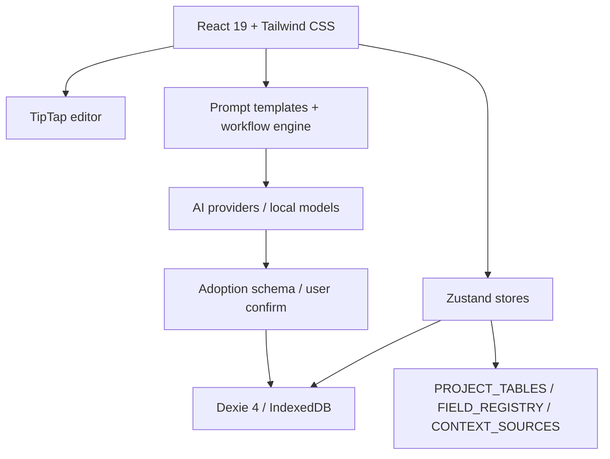

# StoryForge · 故事熔炉

> AI 辅助小说创作工作台。纯前端、本地优先、提示词全透明，让作者掌控从灵感、设定、大纲到正文、审校、导出的一整条创作链路。

**交流与教程**

- GitHub: https://github.com/yuanbw2025/storyforge
- 知乎专栏文档: https://zhuanlan.zhihu.com/p/2038714210188780594
- B 站项目视频说明书: https://www.bilibili.com/video/BV1q37j6QExh/
- QQ 交流群: 1082374587

---


---

## English TL;DR

**StoryForge** is a local-first, browser-based AI writing studio for long-form fiction.

- **Local-first by default**: manuscript data lives in the browser's IndexedDB. AI calls, cloud backup, or custom proxy/base URLs send only the relevant content to the third-party service configured by the user.
- **Bring your own AI**: supports many OpenAI-compatible providers, Anthropic Claude, Gemini, local models, and custom endpoints.
- **No black box**: prompts are visible, editable, cloneable, parameterized, and reusable.
- **Built for long stories**: multiworld settings, story arcs, foreshadowing, state cards, item ledger, temporal facts, retrieval memory, chapter review, style learning, and export/backup workflows.

```bash
npm install
npm run dev      # http://localhost:1111/storyforge/
npm run ci       # schema checks + AI manual check + architecture check + typecheck + coverage + build
```

Read [CONTRIBUTING.md](./CONTRIBUTING.md) before contributing.

---

## 目录

- [项目定位](#项目定位)
- [核心能力](#核心能力)
- [功能全景](#功能全景)
- [AI 与提示词系统](#ai-与提示词系统)
- [数据与安全边界](#数据与安全边界)
- [技术架构](#技术架构)
- [快速启动](#快速启动)
- [开发与验证](#开发与验证)
- [适合谁](#适合谁)
- [文档入口](#文档入口)
- [License](#license)
- [Star History](#star-history)

---

## 项目定位

StoryForge 不是“一键生成完本小说”的黑箱工具，而是给作者使用的 AI 创作工坊：

| 目标 | StoryForge 的做法 |
|---|---|
| 作者掌控创作 | 所有 AI 输出都经过预览、编辑、采纳；AI 是助手，不直接替作者定稿 |
| 提示词可见可改 | 每个 AI 功能背后的 System Prompt、User Template、参数和示例都能查看与克隆 |
| 长篇设定不散 | 世界观、角色、大纲、伏笔、状态、物品、事实、故事线都进入结构化本地数据库 |
| 资料能反哺写作 | 项目参考、历史资料、文风学习、场景考证可进入后续 AI 上下文 |
| 数据本地优先 | 默认无 StoryForge 后端；项目数据存在用户浏览器 IndexedDB |

---

## 核心能力

### 从灵感到项目

- 首页管理所有小说项目，支持新建、删除、从本地文件夹恢复。
- 项目概况维护名称、简介、流派、目标字数、写作状态与多世界开关。
- 灵感反推支持把短梗、片段、想法反推为故事核心、世界观、角色、大纲等可采纳结构。
- 项目参考支持故事参考、风格参考、历史资料，以及上传后的多维分析。

### 设定库

- 多世界总览：管理世界组、世界关系、主世界和跨世界结构。
- 真实与幻想：按维度声明哪些内容取自真实、哪些允许架空改造，给历史考证和架空创作共同使用。
- 世界观：世界起源、自然环境、人文环境、历史年表、世界地图。
- 故事设计：一句话故事、故事概念、主题、核心冲突、故事模式、主线、复线。
- 角色设计：角色生成、主要角色、次要角色、NPC、路人、关系网。

### 创作区

- 创作规则：写作风格、叙事视角、基调、禁忌、一致性规则和参考作品注入。
- 大纲：卷/章树、AI 生成卷纲、章节展开、章节预览。
- 角色驱动：根据人物动机、关系和弧光反推剧情推进。
- 故事线：主线/支线、阶段卡、进度和 AI 生成。
- 章节：章节列表、TipTap 正文编辑、自动保存、续写、润色、扩写、去 AI 味、审校、便签。
- 伏笔：伏笔类型、埋设/呼应/回收状态、紧急度、看板和 AI 建议。
- 文风学习：从已写章节提取作者文风画像，反哺后续生成。
- 重要地点：地点树、标签、层级关系和地点资料。
- 状态表：角色、地点、物品、势力等状态卡和事件时间线。
- 物品栏：追踪物品获得、持有、转移、消耗等账本。
- 事实库：章节正文中抽取的时序事实候选，支持确认/否决后用于长期一致性。
- 故事年表：按章节和剧情时间记录全局事件。
- 场景考证：结合世界观、历史年表和规则检查具体场景细节。

### 提示词库与工作流

- 模板管理：系统模板、用户模板、参数、示例/反例、实时预览。
- 题材包：历史、仙侠、言情、现实主义、悬疑推理等风格可热切换。
- PromptRunPanel：运行时调参、临时改 prompt、流式输出、采纳、标记好/坏示例。
- 工作流：把多个 AI 步骤串起来，支持从故事核心到世界观、角色、大纲、章节的自动编排和写回。

### 导入、导出与备份

- 文档解析：上传或粘贴文本，分块解析为当前项目设定或项目参考。
- 大文档流水线：Blob 持久化、断点续跑、暂停/取消、日志追踪、角色去重合并。
- 数据管理：JSON 完整备份、Markdown/TXT/HTML 导出、本地文件夹自动备份、GitHub Gist 云备份。
- 版本历史：自动快照与手动快照，恢复时创建新项目，避免覆盖当前稿件。
- 消耗统计：按项目或全局查看 AI 调用次数、token 和估算费用。

---

## 功能全景

当前侧边栏由 5 个一级模块组成：

| 一级模块 | 二级入口 |
|---|---|
| 著作信息 | 项目概况、灵感反推、项目参考 |
| 设定库 | 世界总览、真实与幻想、世界起源、自然环境、人文环境、历史年表、世界地图、故事设计、角色生成、主要角色、次要角色、NPC、路人、关系网 |
| 创作区 | 创作规则、大纲、角色驱动、故事线、章节、伏笔、文风学习、重要地点、状态表、物品栏、事实库、故事年表、场景考证 |
| 提示词库 | 模板、题材包、参数、示例/反例、工作流 |
| 设置区 | 版本历史、文档解析、数据管理、消耗统计、设置 |

更细的用户版图文说明书见 [docs/FEATURE-GUIDE.md](./docs/FEATURE-GUIDE.md)。该文档会按页面和二级页签展开，并配套截图。

---

## AI 与提示词系统

StoryForge 的 AI 能力分成三层：

1. **上下文装配**：根据当前任务读取项目概况、世界观、角色、大纲、伏笔、状态、事实、参考资料等内容。
2. **提示词渲染**：用模板变量、条件块、参数开关和 few-shot 示例生成最终 prompt。
3. **结构化采纳**：AI 输出不会直接变成事实，用户确认后才写入字段、集合或章节正文。

### 支持的 AI Provider

设置页内置的 provider 包括：

| 类型 | Provider |
|---|---|
| 国际/聚合 | OpenAI、Anthropic Claude、Google Gemini、Poe、NVIDIA NIM |
| 国内云服务 | DeepSeek、通义千问、豆包、智谱 GLM、文心一言、Kimi、MiniMax、ModelScope、Agnes AI、LongCat、OpenCode Go |
| 本地/自定义 | Ollama、LM Studio 等 OpenAI-compatible 本地服务、自定义 Base URL |

国内或浏览器 CORS 受限的服务可通过本地 Vite 代理转发；自定义接口只要兼容 OpenAI `chat/completions` 即可接入。

### 提示词模板能力

```ts
renderPrompt(template, context, {
  parameterValues,
  overrides,
})
```

| 能力 | 说明 |
|---|---|
| `{{var}}` | 模板变量替换 |
| `{{#if var}}...{{/if}}` | 条件块 |
| 参数控件 | select、slider、number、text、boolean |
| 示例/反例 | 好示例和坏示例自动拼入 prompt |
| 克隆编辑 | 系统模板可克隆为用户模板后自由修改 |
| 工作流写回 | 多步生成结果可自动写回故事、角色、大纲、伏笔等目标 |

---

## 数据与安全边界

StoryForge 是纯前端项目，没有自建应用后端。

| 数据/动作 | 去向 |
|---|---|
| 项目数据 | 默认保存在浏览器 IndexedDB |
| AI API Key | 默认 sessionStorage；用户显式“记住本机”才写 localStorage |
| GitHub PAT | 默认 sessionStorage；用户显式“记住本机”才写 localStorage |
| AI 生成 | 会把相关上下文发送到用户配置的 AI 服务 |
| Gist 云备份 | 会把完整项目 JSON 上传到用户自己的 GitHub 私密 Gist |
| 本地文件夹备份 | 通过浏览器 File System Access API 写入用户授权的本地目录 |

生产环境检测到 IndexedDB schema 缺表时不会自动删库；开发环境才允许自动 reset。启动期会申请浏览器持久化存储，降低 IndexedDB 被浏览器清理的风险。

---

## 技术架构



| 层 | 技术 |
|---|---|
| UI | React 19、TypeScript 5、Tailwind CSS、Lucide Icons |
| 构建 | Vite 6、PWA、按需 lazy loading、vendor chunks |
| 状态 | Zustand 5、多 store、store factory |
| 数据库 | Dexie 4、IndexedDB、42 张 required tables |
| 编辑器 | TipTap 3 |
| 可视化 | react-force-graph-2d、d3-hierarchy、自定义地图组件 |
| 文档/导入 | mammoth、pdfjs-dist、JSZip |
| 架构守卫 | `PROJECT_TABLES`、`FIELD_REGISTRY`、`CONTEXT_SOURCES`、AI manual 生成器、required tables 校验 |

### 三个注册表

项目扩展必须收口到三个单一事实源：

| 注册表 | 负责 |
|---|---|
| `CONTEXT_SOURCES` | AI 读什么，上下文如何装配 |
| `FIELD_REGISTRY` + `ADOPTION_SCHEMAS` | AI 写什么，采纳时如何校验与去重 |
| `PROJECT_TABLES` | 表生命周期，导出/导入/删除/迁移如何覆盖 |

详见 [CLAUDE.md](./CLAUDE.md) 与 [docs/MASTER-BLUEPRINT.md](./docs/MASTER-BLUEPRINT.md)。

---

## 快速启动

### macOS / Linux / Windows 通用

```bash
git clone https://github.com/yuanbw2025/storyforge.git
cd storyforge
npm install
npm run dev
```

打开：

```text
http://localhost:1111/storyforge/
```

### Windows 零基础用户

StoryForge 不再提供 `.bat`、`.exe` 或 Windows Portable 启动器。Windows 用户请下载源码 ZIP，并使用 npm 启动：

1. 到 GitHub Release 下载 `Source code (zip)`。
2. 解压后进入包含 `package.json` 的目录。
3. 安装 Node.js LTS：https://nodejs.org/
4. 在项目目录打开 PowerShell。
5. 执行 `npm install` 和 `npm run dev`。
6. 浏览器打开 `http://localhost:1111/storyforge/`。

详细图文步骤见 [使用npm指令启动项目.md](./使用npm指令启动项目.md)。

---

## 开发与验证

常用命令：

```bash
npm run dev
npm run build
npm run test
npm run test:coverage
npm run check:required-tables
npm run check:ai-manual
npm run check:architecture
npm run ci
```

提交前建议至少跑：

```bash
npm run ci
```

如果只改文档，可按变更范围选择更轻的验证；涉及数据表、AI 读写、导出导入、删除、迁移时必须跑完整验证，并遵守 [CLAUDE.md](./CLAUDE.md) 的三注册表规则。

---

## 适合谁

| 适合 | 不适合 |
|---|---|
| 想掌控提示词和 AI 输出的小说作者 | 只想一键生成完整小说的人 |
| 长篇、系列文、多世界、群像创作者 | 不愿维护设定和大纲的人 |
| 想沉淀个人题材包、风格模板、工作流的人 | 需要多人实时协作和云端团队权限的人 |
| 想把资料、考证、参考作品纳入写作流程的人 | 希望所有数据都托管在官方后端的人 |
| 希望本地优先、可换模型、可自定义接口的人 | 不想配置任何 AI Key 或本地模型的人 |

---

## 文档入口

| 文档 | 用途 |
|---|---|
| [docs/FEATURE-GUIDE.md](./docs/FEATURE-GUIDE.md) | 面向用户的完整功能说明书 |
| [CONTRIBUTING.md](./CONTRIBUTING.md) | 贡献指南 |
| [CHANGELOG.md](./CHANGELOG.md) | 版本变更记录 |
| [CLAUDE.md](./CLAUDE.md) | AI/开发者接手项目必须遵守的规则 |
| [docs/MASTER-BLUEPRINT.md](./docs/MASTER-BLUEPRINT.md) | 重构施工蓝图与架构权威 |
| [docs/AI-FUNCTIONS-MANUAL.generated.md](./docs/AI-FUNCTIONS-MANUAL.generated.md) | 由代码生成的 AI 功能清单 |

---

## License

StoryForge 使用 [MIT License](./LICENSE) 开源。你可以自由使用、复制、修改、分发和商用本项目代码；请保留原始版权与许可声明。

---

## Star History

[查看 StoryForge 的 Star History](https://star-history.com/#yuanbw2025/storyforge&Date)

---

## 功能全景指南

完整图文版功能说明书见 [docs/FEATURE-GUIDE.md](./docs/FEATURE-GUIDE.md)。文档按页面和二级页签展开，包含功能说明、项目逻辑说明和配套截图。
