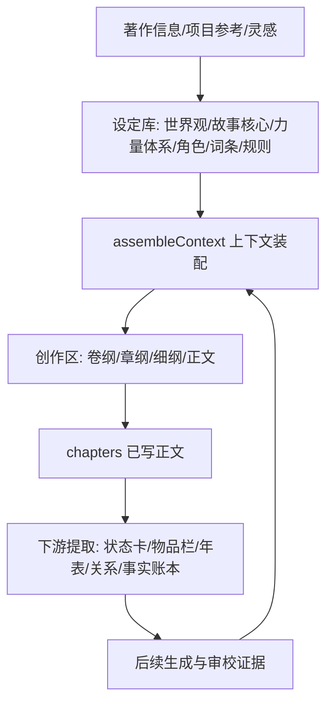
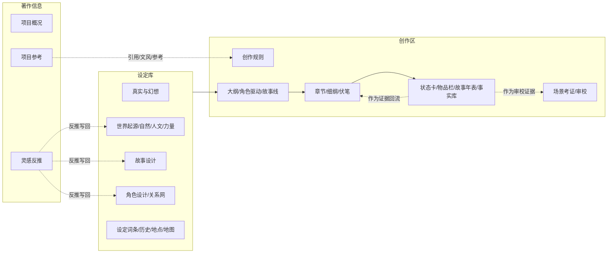
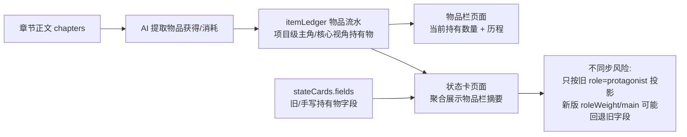
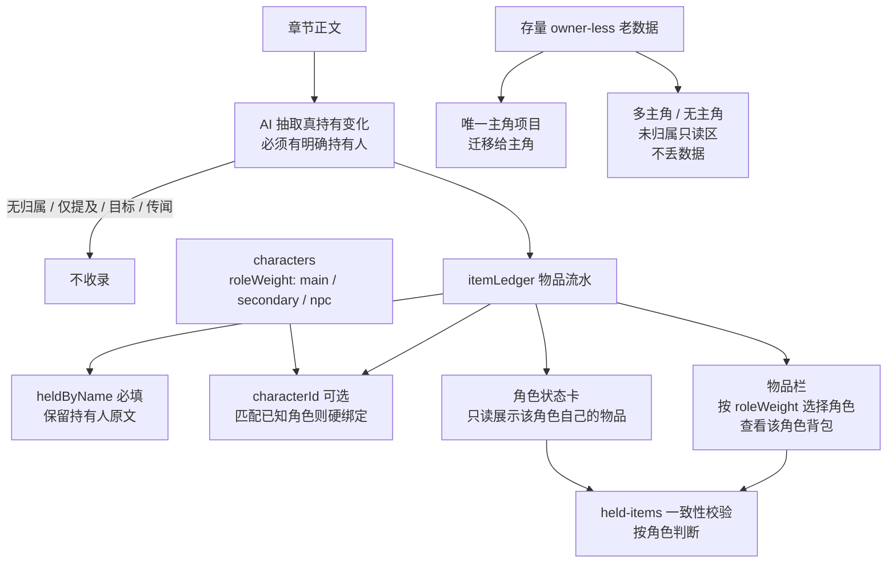
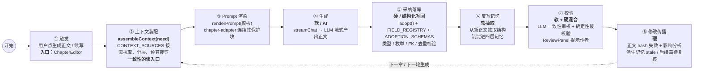
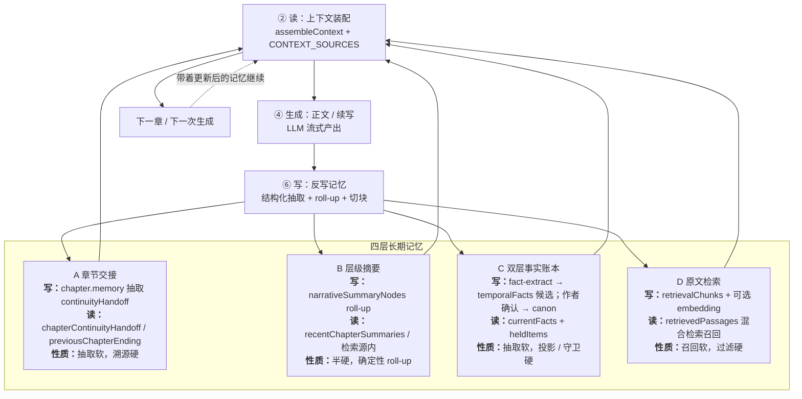
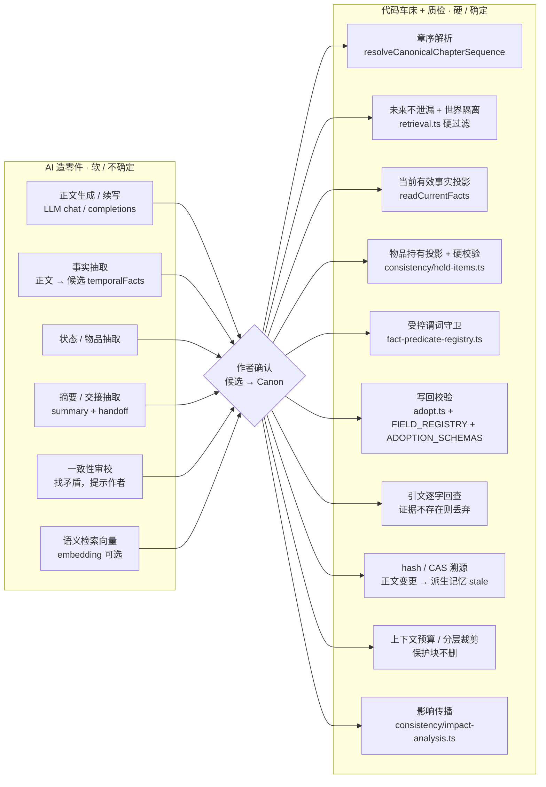
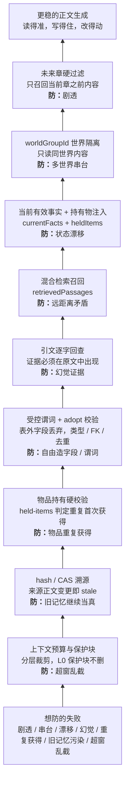

# StoryForge 用户功能说明书

> 更新日期：2026-07-09  
> 截图项目：本地示例项目《星河旧史》  
> 适用对象：第一次打开 StoryForge 的作者、想系统了解功能的用户、需要向他人介绍项目的人。

StoryForge 是一个本地优先的 AI 小说创作工作台。它把“项目资料、世界观、角色、大纲、正文、伏笔、状态、事实、导入导出、提示词”放在同一个创作空间里，并让每一次 AI 生成都能被作者看见、调整、采纳或丢弃。

本文按真实界面结构编写：每个二级页签都有对应截图，截图均来自本地运行项目。

## 目录

- [一、首页](#一首页)
- [二、著作信息](#二著作信息)
- [三、设定库](#三设定库)
- [四、创作区](#四创作区)
- [五、提示词库](#五提示词库)
- [六、设置区](#六设置区)
- [七、项目逻辑与上下游引用](#七项目逻辑与上下游引用)
- [八、推荐使用流程](#八推荐使用流程)
- [九、数据与安全边界](#九数据与安全边界)

---

## 一、首页

首页是所有作品的入口。你可以在这里看到已经创建的项目、总字数、最近更新时间，也可以新建项目或从本地文件夹恢复备份。

主要功能：

- 新建项目：输入项目名称、简介、题材标签、目标字数和写作状态。
- 项目列表：按作品卡片进入具体工作区。
- 本地文件夹恢复：读取之前绑定目录中的 `storyforge-*.json` 备份，恢复为新项目，不覆盖现有项目。
- GitHub 入口：快速打开项目仓库。

适合做什么：开始一本新书、回到旧项目、从备份恢复数据。

---

## 二、著作信息

### 2.1 项目概况

项目概况是作品的“身份证”。这里维护项目名称、题材标签、简介、目标字数和写作状态。

可用功能：

- 修改作品名称和简介。
- 选择多个题材标签，例如架空历史、时空穿梭、仙侠等。
- 调整目标字数。
- 查看创建时间和更新时间。
- 开启多世界模式。

开启多世界后，项目会出现“世界总览”入口：

多世界模式适合诸天流、快穿、无限流、多位面修仙、平行世界等题材。开启前系统会要求确认备份，这是为了保护已有稿件数据。

### 2.2 灵感反推

灵感反推用于处理“我只有一个梗，但还没有完整设定”的阶段。你可以输入短灵感、片段、人物关系、场景想法，交给 AI 反推出结构化创作资料。

可用功能：

- 输入短梗、片段或脑洞。
- 选择反推方向，例如故事核心、世界观、角色、大纲等。
- AI 输出后可按模块采纳，而不是整段直接覆盖。
- 适合从一句话灵感扩展成可写项目。

使用建议：灵感反推更适合短文本。如果你要导入整章、整本或大量资料，建议使用“文档解析”或“项目参考”。

### 2.3 项目参考

项目参考是资料库。你可以把参考小说、风格样本、历史资料、设定文档放在这里，让它们变成后续创作时可调用的材料。

可用功能：

- 新建故事参考、风格参考、历史资料。
- 记录作者、类型、备注和关键笔记。
- 查看导入解析后的分析报告。
- 将参考资料用于创作规则和后续 AI 上下文。

适合放什么：

- 想模仿结构的优秀作品。
- 想学习文风的片段。
- 历史考证资料、论文、史书摘录。
- 自己整理的设定文档。

---

## 三、设定库

### 3.1 世界总览

世界总览只在多世界模式开启后显示。它用于管理一个项目里的多个世界组，以及世界之间的关系。

可用功能：

- 查看主世界和其他世界组。
- 新建世界、编辑世界类型和描述。
- 管理世界之间的连接关系。
- 为不同世界分别维护世界观、角色、地图、历史年表等资料。

适合题材：诸天流、无限流、快穿、多宇宙、修仙多界、平行世界群像。

### 3.2 真实与幻想

真实与幻想是世界规则体系。它不再把项目简单分成“历史”或“幻想”，而是允许你对每个维度单独声明：哪些必须符合真实，哪些允许架空改造。

可用功能：

- 按维度管理真实/架空规则。
- 给历史、地理、制度、宗教、科技、语言、日常生活等设定规则。
- 将规则注入世界观、大纲、正文和场景考证。
- 帮助 AI 避免时代错乱，同时尊重作者明确声明的架空设定。

例子：你可以要求“官制取自真实唐代”，同时允许“修炼体系架空改造”。

### 3.3 世界起源

世界起源负责回答“这个世界从哪里来、底层规则是什么”。页面内部还有 3 个二级功能页：世界来源、力量体系、神明与信仰。每个功能页都包含正文编辑区、扩写/重写/润色模式、补充说明输入框、AI 生成按钮和 PromptRunPanel。

#### 3.3.1 世界来源

世界来源用于写清创世神话、历史起点、文明起源或世界异常来源。示例项目中写入的是“观星仪式失败后，多重史层开始互相覆盖”。

可用功能：

- 手动编辑世界起源文本。
- 用扩写、重写、润色三种模式控制 AI 改写方向。
- 在“给 AI 的补充说明”里临时追加要求。
- AI 生成时会读取真实与幻想规则、故事核心、角色和其它世界观字段。

#### 3.3.2 力量体系

力量体系不是一个泛泛的“强弱等级”字段，它决定人物能力、社会等级、修炼/科技/官职晋升逻辑。示例里演示了“观星、校史、改命”三条力量路径。

可用功能：

- 写力量来源、分层、晋升规则、代价和限制。
- 下方可以继续登记“力量层级 · 具体词条”，把等级、术法、职业或能力路线拆成条目。
- 后续角色生成、正文战斗、场景考证都会读取该字段。

#### 3.3.3 神明与信仰

神明与信仰用于管理宗教、神系、民间信仰、祭祀规则和禁忌。它可以是玄幻神明，也可以是历史题材里的宗法、礼制和信仰体系。

功能演示重点：

- 页面顶部切换“神明与信仰”后，会显示专门的信仰字段。
- PromptRunPanel 展开后，可以看到当前模板、参数、系统提示词和用户提示词覆盖入口。
- 用户可以在不修改模板库的情况下临时调整本次生成要求。
- 生成结果不会直接覆盖字段，必须由用户采纳。

### 3.4 自然环境

自然环境负责地理、气候、资源和物产，是“故事发生在哪里”的基础。页面内部不是一个大文本框，而是 6 个独立功能页：世界结构、疆域尺寸、地貌分布、山川水系、气候环境、自然资源。

#### 3.4.1 世界结构

世界结构用于定义世界的物理层级，例如星球、大陆、行政区划、平行空间、多重天、史层等。示例中演示了“现实王朝、失落史层、星河夹缝”三层结构。

#### 3.4.2 疆域尺寸

疆域尺寸用于写世界整体大小和核心区域范围。它可以是“九州”“三十六城”“一颗星球”“七层天界”，也可以是历史题材里的疆域和行政范围。

可用功能：

- 写疆域规模、边界、核心区域、远方区域。
- 给后续地图、重要地点、行军路线和势力分布提供范围约束。
- AI 生成时会参考世界来源和已有自然环境字段，避免地理尺寸前后矛盾。

#### 3.4.3 地貌分布

地貌分布用于写大陆、山脉、平原、盆地、海域、荒漠、秘境等空间格局。示例项目把世界拆成“中原平畴、北境寒原、西岭台地、南方水网、东海星潮”五区。

写作价值：它会影响城市位置、交通路线、战争方向、资源分布和人物迁徙。

#### 3.4.4 山川水系

山川水系用于写重要山脉、河流、湖泊、运河和海域。历史、权谋、战争、商路题材尤其需要这个字段。

可用功能：

- 写山脉与河流名称。
- 写水路、漕运、险关和天然屏障。
- 为“重要地点”和“场景考证”提供地理依据。

#### 3.4.5 气候环境

气候环境用于写区域气候、季节、灾害和异常天象。示例项目中演示了北境雪灾、南方洪涝和“错史天象”。

写作价值：气候可以推动剧情，例如饥荒、雪封边关、洪水断路、星蚀引发仪式。

#### 3.4.6 自然资源

自然资源用于写矿物、灵材、植物、动物、战略物资和地方特产。示例中使用了星砂、历木、寒铁、月白贝等资源。

自然资源页还有两层功能：

- 上方“全貌”文本：写总体分布和资源对世界的影响。
- 下方“自然物产 · 具体词条”：把矿物、灵植、异兽拆成可检索条目。
- 旧版纯文本兼容区：保留珍禽异兽、灵药粮食、矿石金属、其他特产四个旧字段。

PromptRunPanel 展开后，可以看到自然资源也走同一套可调提示词系统：模式、补充说明、模板参数、临时 prompt 覆盖、AI 生成和采纳。

### 3.5 人文环境

人文环境负责“人在这个世界里如何生活、争斗、结盟和失败”。页面内部有 8 个功能页，每个功能页都有全貌文本、AI 生成、PromptRunPanel 和对应的具体词条区。

#### 3.5.1 世界历史线

世界历史线用于写从远古到当下的历史脉络。它是历史年表的上层概述，适合写朝代更替、文明兴衰、灾变与时代分期。

#### 3.5.2 世界大事记

世界大事记用于写改变世界格局的关键事件。它和历史年表联动：这里写概览，历史年表逐条管理事件、年份、来源和剧情影响。

#### 3.5.3 种族与民族

种族与民族用于写族群、民族、种族能力、历史关系和文化差异。它可以服务玄幻种族，也可以服务历史题材中的民族关系。

#### 3.5.4 势力分布

势力分布用于写朝廷、门派、商会、军府、宗教组织、家族和秘密结社。它会直接影响角色阵营、冲突结构和剧情推进。

#### 3.5.5 城池重镇

城池重镇用于写核心城市、军事重镇、商业都会、宗门驻地。自然环境负责“地理在哪里”，城池重镇负责“人类社会如何占据这些地点”。

#### 3.5.6 政治/经济/文化

政治/经济/文化用于写政体、货币、赋税、阶层制度、宗教礼仪、风俗节庆和社会日常。它是历史考证和架空社会可信度的关键字段。

#### 3.5.7 矛盾冲突

矛盾冲突用于写社会内在矛盾、阶级冲突、阵营冲突、个体与制度的冲突。它会反哺故事设计、角色驱动和故事线。

#### 3.5.8 道具与器物

道具与器物用于写武器、法器、工具、科技装备、礼器和关键物品体系。这里写的是物品体系概述；具体主角是否获得、转移、消耗某个物品，要到“物品栏”追踪。

和自然环境一样，人文环境的每个内部页都可以展开 PromptRunPanel。你可以只对“道具与器物”临时改 prompt，不影响“世界历史线”或其它字段。

### 3.6 历史年表

历史年表用于记录项目中的重要历史事件和关键词细节。它既可以管理真实史实，也可以管理架空事件。

可用功能：

- 添加历史事件。
- 添加历史关键词。
- 标注真实史实、虚构事件、史实锚点。
- 记录时间、地点、史料来源、剧情影响。
- 使用 AI 历史考证和细节头脑风暴。

适合用法：历史题材可以放真实时间线；玄幻/奇幻可以放王朝兴亡、宗门战争、灾变纪元。

### 3.7 世界地图

世界地图用于把地理设定可视化。它可以根据项目里的地理和地点资料生成地图视图。

可用功能：

- 查看世界地图面板。
- 使用世界树和地点资料组织空间结构。
- 为地点、地貌、势力范围、行军路线等提供视觉辅助。
- 多世界模式下可按世界分别维护。

使用建议：先在自然环境和重要地点里填入基础资料，再使用地图功能，效果更清晰。

### 3.8 故事设计

故事设计是全书核心。它记录故事最重要的概念、主题、冲突和线索。

页面内部按字段拆成多个二级功能页：

- 一句话故事。
- 故事概念。
- 主题表达。
- 核心冲突。
- 故事模式。
- 主线与复线。

每个字段页都有同一套操作：

- 手动写入或修改字段内容。
- 在扩写、重写、润色三种模式之间切换。
- 在“补充提示”里告诉 AI 本次要强化什么。
- 展开当前模板，查看或临时调整本次 System Prompt / User Template。
- AI 结果生成后再决定是否采纳，不会自动覆盖已有设定。

写作价值：后续大纲、角色驱动、故事线和正文生成都会引用这里的信息。

### 3.9 角色生成

角色生成用于从零创建角色。你可以让 AI 设计人物，也可以手动创建后再补全维度。

角色生成页的第一层操作是“创建并分流”：新建角色时必须先选择戏份权重和阵营轴，例如主要、次要、NPC、路人，以及守序/中立/混乱、善良/中立/邪恶。这样角色一出生就能进入正确的页签。

维度选择器用于控制 AI 本次要设计哪些内容。它不是只有姓名和外貌，而是覆盖身份、年龄种族、外貌、地点、性格、价值观、优缺点、恐惧、动机、目标、核心矛盾、背景、关键经历、能力、实力定位、语言风格等 23 个维度。

PromptRunPanel 可以展开查看角色生成模板、参数和临时 prompt 覆盖。你可以只让 AI 补全缺失维度，也可以把“只设计反派”“偏群像”“更克制现实主义”等要求写进本次补充说明。

手动创建后会立即进入角色详情。页面顶部显示角色戏份、阵营、所属世界、AI 补全缺项数量；右侧可以继续切换戏份和阵营。

角色详情上半区适合填写身份、年龄种族、外貌、常驻地点、性格、价值观、优点、缺点和恐惧软肋。

向下滚动后可以继续维护动机、目标、核心矛盾、背景故事、关键经历、能力、实力定位和语言风格等字段。所有这些字段都会成为后续角色驱动、大纲、正文生成和状态提取的上下文。

适合用法：先生成主角、反派、关键配角，再回到主要角色页做细化。

### 3.10 主要角色

主要角色页展示核心人物。这里适合维护主角、重要配角、反派、导师等长期参与剧情的人物。

主要角色页只显示戏份权重为“主要”的角色。角色卡片可以进入同一套详情编辑器，因此角色生成页创建的主角会自动出现在这里。

可用功能：

- 按主要角色列表快速切换人物。
- 查看角色一句话信息、戏份、阵营和所属世界。
- 编辑 23 个角色维度。
- 使用“AI 补全设定”只补缺失字段。
- 查看角色状态面板，和“状态表”联动。

写作价值：章节正文生成会优先读取主要角色，避免人物行为和设定前后不一致。

### 3.11 次要角色

次要角色用于管理有一定戏份但不承担主线核心的人物。

可用功能：

- 以更轻量的卡片方式查看角色。
- 维护姓名、身份、作用、与主线关系。
- 可从角色生成页调整角色戏份后进入此页。

适合对象：同门、官员、同事、小队成员、阶段性敌人。

### 3.12 NPC

NPC 页用于管理常驻但戏份较轻的人物。

可用功能：

- 查看 NPC 列表。
- 记录姓名、地点、身份和一句话作用。
- 适合作为场景、城市、组织中的背景角色库。

写作价值：让世界显得有人生活，而不是只有主角和反派。

### 3.13 路人

路人页用于管理一笔带过、短暂出场或功能性角色。

可用功能：

- 以表格方式管理姓名、出场章节、作用、结局。
- 适合记录证人、士兵、店主、路人甲等角色。
- 防止同一小人物在不同章节反复变名或身份冲突。

### 3.14 关系网

关系网用于可视化角色之间的连接。

可用功能：

- 新建角色关系。
- 标注亲属、师友、敌对、合作、暧昧、竞争等关系类型。
- 查看关系图。
- 从文本中提取关系。

写作价值：群像、多阵营、权谋、情感线作品都可以用关系网降低混乱。

---

## 四、创作区

### 4.1 创作规则

创作规则是正文生成的写作约束中心。

可用功能：

- 设置写作风格。
- 设置叙事视角。
- 维护整体基调、禁忌、一致性规则。
- 选择要参考的项目参考资料。
- 让 AI 根据项目资料建议规则。

常见用法：

- 写清“正文应该像什么”，例如克制、冷峻、爽文、史书感、轻喜剧等。
- 写清“正文不能做什么”，例如不能现代口语、不能跳设定、不能提前揭谜。
- 选择项目参考，让 AI 在写正文时参考风格样本或历史资料。
- 与真实与幻想规则共同约束正文生成。

写作价值：它决定 AI 写正文时“应该怎么写”和“不能怎么写”。

### 4.2 大纲

大纲页用于管理卷、章结构。

大纲左侧是卷列表，右侧是当前卷详情。你可以手动添加卷，也可以用“批量生成卷级大纲”让 AI 先规划全书卷结构。

每卷内部可以继续添加章节。章节行支持编辑标题、填写章纲摘要、AI 生成本章章纲、在当前章下方插入章节、打开正文编辑和删除。

示例项目中手动填写了卷纲摘要和章纲摘要。卷纲用于约束本卷整体走向，章纲用于约束单章写作目标。

PromptRunPanel 展开后可以调整卷级大纲生成参数，例如整体节奏、建议卷数、补充说明和临时 prompt。章节级生成也有独立模板。

可用功能：

- 新建卷、章节点。
- 批量生成卷级大纲。
- 为单卷生成全部章节。
- 为单章补全章纲。
- 手动编辑卷纲摘要和章节摘要。
- 拖动调整卷和章节顺序。
- 点击章节行的编辑按钮进入正文编辑器。

适合流程：先用故事设计生成全书方向，再在大纲页拆卷、拆章。

### 4.3 角色驱动

角色驱动用于从人物出发推动剧情。

可用功能：

- 基于角色目标、动机、关系和弧光生成剧情建议。
- 从角色行为反推冲突和事件。
- 帮助避免“剧情推着人物走”的问题。
- 可以添加角色，填写初始状态、目标状态、关键阻力和转变节点。
- 生成后可把选中的卷或章节导入大纲。

适合用法：当主线卡住时，切到角色驱动，看人物自己会把故事推向哪里。

### 4.4 故事线

故事线用于管理主线和支线。

可用功能：

- 新建主线、支线、感情线、阵营线等。
- 管理故事线阶段卡。
- 查看进度。
- 使用 AI 生成故事线结构。

写作价值：长篇小说常有多条线并行，故事线页帮助你知道每条线推进到哪里。

### 4.5 章节

章节页是正文写作中心。它把章节列表和正文编辑器组织在一起。

从大纲点“编辑章节”后会进入章节编辑页。左侧按卷显示章节列表，顶部显示章节名、字数和章节状态。章节状态包括仅大纲、初稿、已修改、已润色、定稿。

写入正文后，续写、提取状态、提取事实、影响分析和质量审校等按钮会从禁用变为可用。正文编辑器提供字体、字号、行距、段距、字色、背景色、加粗、斜体、标题、列表、引用、分割线、撤销和重做等富文本工具。

“上下文”按钮可以查看将发送给 AI 的资料，包括世界观、角色、章节大纲以及按需召回的状态卡。它帮助作者判断 AI 为什么会这样写。

“大纲预览”会展开当前章的章纲和场景细纲，适合写作时随时对照本章目标。

“便签”用于给当前章节或全局记录临时想法。便签不会替你改正文，但适合放待改点、伏笔提醒、下章承接。

可用功能：

- 查看章节列表和状态。
- 打开 TipTap 富文本编辑器。
- 自动保存正文。
- AI 写正文、续写、润色、扩写、去 AI 味。
- 输入自定义指令，让本次生成更具体。
- 查看上下文、大纲预览、章节便签、情感节拍卡。
- 从正文提取状态变化，写入状态表。
- 从正文提取事实候选，写入事实库。
- 做影响分析，检查历史章修改对后续事实的影响。
- 打开质量审校，检查因果、动机、伏笔和一致性问题。

适合流程：在大纲页生成章节后，进入章节页逐章写作和打磨。

### 4.6 伏笔

伏笔页用于管理埋设、呼应和回收。

伏笔页默认提供看板视图。状态列包括计划中、已埋设、已呼应、已回收。顶部会提示伏笔不会自动改写已经写好的正文，它会在生成或续写对应章节时作为任务提醒注入上下文。

列表视图适合编辑伏笔详情。示例中创建了“会改写年号的星图”，填写描述，并关联埋设章节、呼应章节和回收章节。

点击“推进状态”可以把伏笔从计划中推到已埋设、已呼应、已回收。状态推进不会自动改正文，只是改变追踪状态。

看板视图适合检查全书还有哪些承诺没有兑现。

可用功能：

- 新建伏笔。
- 标记伏笔类型。
- 管理计划、埋设、呼应、回收状态。
- 查看列表或看板。
- 使用 AI 建议伏笔。
- 识别逾期或高紧急度伏笔。
- 指定埋设章节、多个呼应章节和回收章节。
- 将伏笔任务注入对应章节的生成、续写和审校上下文。

写作价值：长篇最怕前面埋了后面忘。伏笔页就是全书的“未兑现承诺清单”。

### 4.7 文风学习

文风学习用于从你自己的章节中提取写作风格。

可用功能：

- 从已写章节学习文风画像。
- 记录句式、节奏、词汇偏好、叙事习惯。
- 把文风画像注入后续正文生成。

适合用法：写出几章样稿后再开启，让后续 AI 更贴近你的文字。

### 4.8 重要地点

重要地点用于管理故事里的地点树。

可用功能：

- 新建地点。
- 维护地点层级。
- 添加标签、说明、所属世界。
- 为场景、路线、势力范围提供空间资料。
- 从章节正文中提取地点。
- 和世界地图、场景考证、章节上下文联动。

适合对象：城市、宗门、宫殿、边关、秘境、星球、街区。

### 4.9 状态表

状态表用于追踪角色在章节推进中的当前状态、地点、势力、物品和剧情进度。

状态表以角色为中心。只要角色库里有角色，这里就会出现角色状态卡；如果还没有提取或录入状态，卡片会显示“待提取”。

状态卡可以手动编辑字段。示例中添加了“当前状态”“所在地点”“持有物”等字段。

保存后状态卡会聚合展示所在地点、所属势力、剧情进度、持有物和当前状态。导出按钮也会变为可用，可以把状态上下文导出为文本。

可用功能：

- 查看状态卡。
- 手动添加状态字段。
- 从章节正文中提取角色状态变化。
- 聚合地点、势力、持有物和章节进度。
- 导出状态上下文。
- 在章节写作时按需注入相关状态卡。

写作价值：角色去了哪里、伤势如何、谁拿着什么、组织是否覆灭，都可以在这里长期追踪。

### 4.10 物品栏

物品栏用于追踪物品的持有、转移和消耗。

物品栏顶部显示当前种类、持有总量、流水记录。你可以手动添加，也可以从已写正文中提取。

展开物品后会看到获得/消耗时间线。每条流水可以编辑物品名、数量、动作和备注。

物品栏的重点不是单个“道具设定”，而是“某个物品在剧情中什么时候获得、什么时候消耗、目前还剩多少”。

可用功能：

- 查看物品账本。
- 记录获得、持有、转移、丢失、消耗。
- 与章节和状态表联动。
- 帮助检查“角色没拿到物品却突然使用”的问题。
- 从正文批量提取物品流水。
- 手动补录物品事件。
- 展开每个物品查看历史流水。

适合对象：法宝、信物、钥匙、药物、武器、证据、任务道具。

### 4.11 事实库

事实库用于沉淀章节中已经发生的事实。

事实库按状态分为异常待复核、待确认候选、已确认 Canon、已被取代、已否决。顶部可以导出事实/记忆 Markdown，也可以导入外部整理好的候选 diff。

导入候选 diff 只会进入 candidate，不会直接成为权威事实。这样可以让外部整理、AI 抽取和人工判断分开。

候选事实进入“待确认候选”后，作者可以点击确认成为 Canon，也可以否决。只有确认后的事实才会稳定注入后续生成。

可用功能：

- 查看 AI 从正文中抽取的事实候选。
- 确认、否决或保留候选事实。
- 将确认事实用于后续生成和一致性检查。
- 导出事实/记忆 Markdown。
- 导入外部候选 diff。
- 标记来源正文变更后的异常事实，等待人工复核。

写作价值：它让“已经写过的事实”不再散落在正文里，而是变成可检索、可注入的长期记忆。

### 4.12 故事年表

故事年表记录剧情内部的事件顺序。

可用功能：

- 查看项目事件。
- 按章节打开相关内容。
- 与章节、状态表、事实库共同构成时间线。
- 从已写正文中提取剧情事件。
- 按章节进程排序，而不是按世界历史年份排序。

区别：历史年表偏世界背景；故事年表偏正文已经发生或计划发生的剧情事件。

### 4.13 场景考证

场景考证用于检查单个场景是否符合设定、历史和真实与幻想规则。

可用功能：

- 输入或选择场景。
- 调用 AI 检查时代、地点、制度、器物、称谓、生产力等问题。
- 给出风险提示和替代写法。
- 可填写时代背景和地点背景，帮助 AI 更精准考证。
- 会读取真实与幻想规则、历史资料、世界观和相关前文。

适合用法：历史、权谋、硬设定、严肃幻想题材在写关键场景前先跑一遍。

---

## 五、提示词库

### 5.1 提示词库

提示词库是 StoryForge 的核心差异化。这里可以看到每个 AI 功能背后的 prompt，而不是把提示词藏在后端。

模板页左侧按模块分组，例如世界观、角色、大纲、章节、伏笔等。顶部可以切换题材包、系统内置/我的模板，也可以新建、导入、导出全部模板。

选择模板后，右侧展示 System Prompt 和 User Template。系统模板默认只读，可以克隆为自己的版本后再改。模板支持变量，例如项目名、题材、世界观上下文、已有角色等。

工作流页用于把多个提示词步骤串起来。每个工作流可以运行、克隆和导出。工作流结果可以复制到对应模块，也可以配置为批量创建角色、大纲节点或伏笔等结构化目标。

可用功能：

- 查看系统模板。
- 克隆系统模板为自己的版本。
- 编辑 System Prompt 和 User Template。
- 管理参数控件。
- 管理好示例和坏示例。
- 实时预览渲染结果。
- 切换题材包。
- 管理和运行工作流。

写作价值：你可以把 StoryForge 调成自己的写作工具，而不是被固定风格控制。

---

## 六、设置区

### 6.1 版本历史

版本历史用于保护项目进度。

可用功能：

- 查看自动快照。
- 创建手动快照。
- 给手动快照命名。
- 从快照恢复为新项目，不覆盖当前项目。
- 删除不需要的快照。
- 避免直接覆盖当前稿件。

使用建议：大改世界观、大纲或正文前，先创建一个手动快照。

### 6.2 文档解析

文档解析用于导入外部文本。

页面支持上传文件或直接粘贴文本。适合导入旧设定集、角色表、世界观资料、旧稿正文或历史资料。

粘贴内容后，“开始解析”按钮会变为可用。解析会调用你配置的 AI 服务，因此正式运行前建议确认 API Key、模型和成本。

可用功能：

- 上传或粘贴文本。
- 选择写入当前项目或存为项目参考。
- 分块解析长文档。
- 断点续跑、暂停、取消。
- 复用已解析会话。

适合对象：旧设定文档、角色表、世界观资料、小说原文、历史资料、参考作品。

### 6.3 数据管理

数据管理负责导出、导入、备份和恢复。

可用功能：

- 导出完整 JSON 备份。
- 导入 JSON 为新项目。
- 导出 Markdown、TXT、HTML。
- 绑定本地文件夹自动备份。
- 配置 GitHub Gist 云备份。
- 管理手动快照。
- 粘贴 GitHub Personal Access Token 连接 Gist。
- 选择是否把 PAT 记住在本机。

重要提示：Gist 备份会把完整项目 JSON 明文上传到你的 GitHub 私密 Gist；Private Gist 不是端到端加密保险箱。

### 6.4 消耗统计

消耗统计用于查看 AI 调用成本。

可用功能：

- 按当前项目或全部项目查看。
- 统计调用次数、token、估算费用。
- 按功能类别查看消耗。
- 清理统计记录。
- 设置美元到人民币汇率。
- 切换统计范围。
- 刷新当前统计。

适合用法：调试提示词、评估模型成本、发现特别耗 token 的工作流。

### 6.5 设置

设置页主要用于配置 AI 和辅助能力。

AI 模型配置是使用 StoryForge AI 功能前必须检查的地方。API Key 默认只保存在本次浏览器会话；只有勾选“记住在本机”才会写入 localStorage。发起 AI 生成、测试连接或使用自定义 Base URL 时，相关提示词和上下文会发送到你配置的模型服务。

下半区提供语义向量检索和主题设置。不开 embedding 时，远距前文召回仍可走本机关键词通道；开启后会叠加语义召回。云端 embedding 会把正文发送给对应服务商，本地 Ollama 则可保持在本机。

可用功能：

- 选择 AI Provider。
- 填写 API Key、Base URL、模型名。
- 设置 temperature、max tokens、上下文窗口。
- 测试连接。
- 保存多个配置预设。
- 配置本地模型或自定义 OpenAI-compatible 接口。
- 配置 embedding 检索通道。
- 重置新手引导。
- 切换界面主题。

支持的接入方式包括 OpenAI、Claude、Gemini、DeepSeek、通义、豆包、智谱、文心、Kimi、MiniMax、NVIDIA NIM、Poe、ModelScope、Agnes AI、LongCat、OpenCode Go、Ollama、本地 LM Studio 和自定义接口。

---

## 七、项目逻辑与上下游引用

StoryForge 不是一组互不相干的页面，而是一条持续回流的创作链：前期资料进入设定库，设定库约束大纲和正文，正文再反向抽取状态、物品、事实、年表和伏笔证据，下一轮生成继续读取这些结构化记忆。

本节整理自 WPS 云盘 `storyforge故事熔炉/真实一致性结构图_20260709` 中的上下游引用逻辑图与生成一致性图集。HTML 总览图已同步为本地资产：[generation-consistency-overview.html](assets/feature-guide/logic/generation-consistency-overview.html)，四个生成一致性 Mermaid 图原文保存在：[GENERATION-CONSISTENCY-DIAGRAMS.md](assets/feature-guide/logic/GENERATION-CONSISTENCY-DIAGRAMS.md)。

### 7.1 全局上下游闭环

这张图说明 StoryForge 的核心闭环：

- 著作信息、项目参考、灵感反推是上游输入。
- 世界观、故事设计、角色、创作规则是生成正文前的结构化约束。
- `assembleContext()` 把需要的上游资料装配给 AI。
- 章节正文不是终点，它会继续沉淀为状态、物品、事实、年表和伏笔证据。
- 下游证据会回到下一轮上下文，帮助后续章节保持一致。

### 7.2 大页面与二级页签串联

实际使用时可以按这个方向理解各页关系：

- “灵感反推”可以写回世界观、故事设计和角色。
- “项目参考”会通过创作规则、文风学习和上下文引用影响正文生成。
- “设定库”决定大纲、角色驱动、故事线和正文能写什么。
- “章节”产生的正文会进入状态表、物品栏、故事年表和事实库。
- “场景考证”和“质量审校”会读取这些证据，帮助作者发现矛盾。

### 7.3 状态卡与物品栏的当前逻辑

物品栏和状态表不是重复功能：

- 物品栏是物品流水的主事实源，重点是“何时获得、何时消耗、当前剩余多少”。
- 状态表是角色聚合看板，可以展示物品栏摘要，也可以显示手写状态字段。
- 正文里的“从正文提取物品栏”会写入 `itemLedger`。
- 章节里的“提取状态”会更新角色状态卡。

当前需要注意的边界：如果角色归属无法唯一判断，物品栏摘要不应强行归给某个角色。文档记录了这个同步风险，后续修复方向是让物品流水主事实源保持独立，同时让状态表只读展示明确归属的摘要。

### 7.4 物品归属待修方向

INVENTORY-1 的方向是把物品栏从“项目级主角流水”升级为“按角色归属的流水”。细节以 `docs/ROADMAP.md` 的 INVENTORY-1 为准，本节只说明用户能感知的目标：

- `itemLedger` 增加 `heldByName` 和 `characterId`：`heldByName` 必填，保存 AI 看到的持有人名字；如果能匹配到角色卡，再写入 `characterId` 形成硬绑定。
- 物品不再默认归给“唯一主角”，也不再使用 `resolveInventoryOwner(characters)` 这种临时判定。谁持有，就归到谁名下。
- 物品栏按 `roleWeight` 分组和切换，可以查看主角、次要角色、NPC 各自的背包。
- 角色状态卡只读展示“该角色自己”的物品摘要，和物品栏保持一致。
- 抽取有两条硬规则：无明确归属不收录；只提及、当目标、传闻、假设不收录。只有“真的发生持有变化，并且有明确持有人”的物品事件才进入物品栏。
- 转移要判断方向：“A 把剑给了 B”应记录 A 消耗、B 获得，不能把同一件物品复制到两个人名下。
- “目标物品”不是“持有物”。角色想要、图谋、听说过的东西不进入物品栏，等正文真的写到获得或失去时再记录。
- 存量老数据按旧语义处理：老的无归属流水默认是主角物品，迁移给唯一主角；如果历史项目无法判断唯一主角，则进入“未归属”只读区，保留数据但不静默改错。
- `held-items` 一致性校验也要按角色判断：A 是否已持有某物，不受 B 的背包影响。

### 7.5 主生成管线

正文生成不是“把 prompt 发给模型”这么简单。它先由 `CONTEXT_SOURCES` 装配上下文，再由提示词模板渲染，AI 输出后进入采纳、结构化写回、反写记忆、审校和影响传播。

### 7.6 四层长期记忆闭环

四层记忆对应不同问题：

- 章节交接解决“上一章刚发生什么，下一章该接什么”。
- 层级摘要解决“长篇几百章后还要知道前面大势”。
- 事实账本解决“已经确认发生的事实不能被后续生成推翻”。
- 原文检索解决“远距离细节和伏笔需要能召回原文证据”。

### 7.7 AI 与代码的软硬分界

简单说：AI 负责生成、抽取和提出建议；代码负责校验、簿记、溯源、预算、隔离和失效传播；作者确认是“候选变成权威事实”的闸门。

### 7.8 稳固生成护栏栈

这些护栏沿着生成链路分布：

- 读之前做世界隔离、未来章过滤和预算裁剪。
- 写之前做字段、枚举、外键、去重和受控谓词校验。
- 写之后做 hash 溯源、事实确认、派生记忆失效。
- 修改历史章节后，通过影响分析提醒后续章节复核。

---

## 八、推荐使用流程

### 新书从零开始

1. 首页新建项目，填写名称、题材和简介。
2. 到“故事设计”写一句话故事、主题和核心冲突。
3. 到“真实与幻想”声明真实/架空边界。
4. 到“世界起源、自然环境、人文环境”补世界观。
5. 到“角色生成”创建主要人物。
6. 到“大纲”生成卷纲和章节。
7. 到“章节”开始写正文。
8. 用“伏笔、状态表、物品栏、事实库”维护长期一致性。

### 已有旧文档导入

1. 到“文档解析”上传设定或正文。
2. 选择导入当前项目或保存为项目参考。
3. 检查导入报告。
4. 到对应页面确认世界观、角色、大纲、参考资料。
5. 用“灵感反推”和“故事设计”整理成可继续写的结构。

### 历史/考证题材

1. 到“真实与幻想”标出必须真实的维度。
2. 到“历史年表”建立史实锚点。
3. 到“项目参考”保存史料和文献。
4. 写关键场景前使用“场景考证”。
5. 正文生成时让 AI 同时读取世界规则、历史年表和项目参考。

---

## 九、数据与安全边界

StoryForge 默认没有自建后端，项目数据存放在浏览器 IndexedDB。

需要注意：

- 清理浏览器数据可能删除项目。
- 建议定期导出 JSON 完整备份。
- 重要项目建议绑定本地文件夹自动备份。
- AI 生成会把相关上下文发送到你配置的 AI 服务。
- GitHub Gist 云备份会把完整项目 JSON 上传到你的 GitHub 私密 Gist。
- API Key 和 GitHub PAT 默认只保存在当前浏览器会话；只有选择“记住本机”才会持久保存。

最稳妥的习惯：重要节点先手动快照，再导出 JSON，再做大规模导入、迁移或删除。
